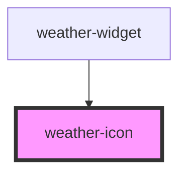

# weather-icon

<!-- Auto Generated Below -->

## Properties

| Property | Attribute | Description | Type     | Default     |
| -------- | --------- | ----------- | -------- | ----------- |
| `owmId`  | `owm-id`  |             | `number` | `undefined` |

## Dependencies

### Used by

 - [weather-widget](../weather-widget)

### Graph

----------------------------------------------

*Built with [StencilJS](https://stenciljs.com/)*
